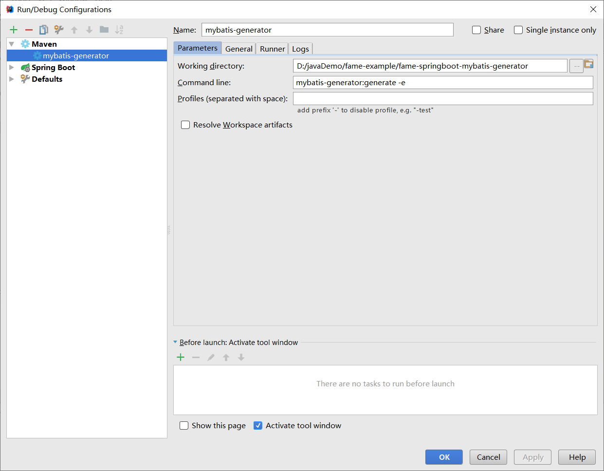
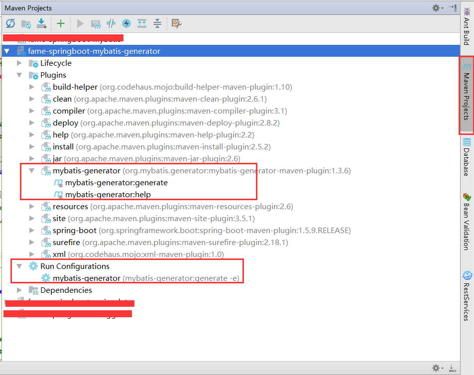
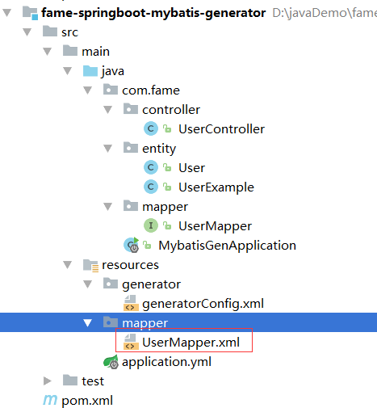

# Mybatis-Genarator 逆向工程使用

> 个人开发环境
>
> java环境：Jdk1.8.0_60
>
> 编译器：IntelliJ IDEA 2017.1.4
>
> mysql驱动：mysql-connector-java-5.1.39.jar （用于逆向工程使用）
>
> Genarator 版本：mybatis-generator-maven-plugin （1.3.6）
>
> 源码连接：待整理

## 第一步 添加依赖

```xml
<!--springBoot相关-->
    <parent>
        <groupId>org.springframework.boot</groupId>
        <artifactId>spring-boot-starter-parent</artifactId>
        <version>1.5.9.RELEASE</version>
    </parent>

    <!--约定版本-->
    <properties>
        <mybatis-spring-boot>1.2.0</mybatis-spring-boot>
        <mysql-connector>5.1.39</mysql-connector>
    </properties>

    <dependencies>
        <!--springBoot相关-->
        <dependency>
            <groupId>org.springframework.boot</groupId>
            <artifactId>spring-boot-starter-web</artifactId>
        </dependency>

        <!--mybatis相关-->
        <dependency>
            <groupId>org.mybatis.spring.boot</groupId>
            <artifactId>mybatis-spring-boot-starter</artifactId>
            <version>${mybatis-spring-boot}</version>
        </dependency>

        <!--mysql驱动相关-->
        <dependency>
            <groupId>mysql</groupId>
            <artifactId>mysql-connector-java</artifactId>
            <version>${mysql.version}</version>
        </dependency>

        <!--pojo实用小插件-->
        <dependency>
            <groupId>org.projectlombok</groupId>
            <artifactId>lombok</artifactId>
            <!--依赖不传递-->
            <optional>true</optional>
        </dependency>

    </dependencies>

    <build>
        <plugins>
            <plugin>
                <groupId>org.springframework.boot</groupId>
                <artifactId>spring-boot-maven-plugin</artifactId>
            </plugin>
            <!-- mybatis generator 自动生成代码插件 -->
            <plugin>
                <groupId>org.mybatis.generator</groupId>
                <artifactId>mybatis-generator-maven-plugin</artifactId>
                <version>1.3.6</version>
                <configuration>         <configurationFile>${basedir}/src/main/resources/generator/generatorConfig.xml</configurationFile>
                    <overwrite>true</overwrite>
                    <verbose>true</verbose>
                </configuration>
            </plugin>
        </plugins>
    </build>
```


## 第二步 配置文件

### application.yml（src/main/resources/application.yml）

```yml
server:
  # 服务端口
  port: 8083

spring:
  datasource:
    url: jdbc:mysql://localhost:3306/springboot-mybatis
    username: root
    password: 123456
    driver-class-name: com.mysql.jdbc.Driver

# Mybatis 配置
mybatis:
  typeAliasesPackage: com.fame.entity
  mapperLocations: classpath:mapper/*.xml

# 打印sql
logging:
  level:
     # 配置mapper接口的包路径
     com.fame.mapper : debug
```


### generatorConfig.xml（src/main/resources/generator/generatorConfig.xml）

**1）配置数据信息 2）修改相关包名 3）配置相关表属性**

```xml
<?xml version="1.0" encoding="UTF-8"?>
<!DOCTYPE generatorConfiguration
        PUBLIC "-//mybatis.org//DTD MyBatis Generator Configuration 1.0//EN"
        "http://mybatis.org/dtd/mybatis-generator-config_1_0.dtd">

<generatorConfiguration>
    <!--mysql 连接数据库jar 这里选择自己本地位置-->
    <classPathEntry location="D:/mysql-connector-java-5.1.39.jar" />
    <context id="testTables" targetRuntime="MyBatis3">
        <commentGenerator>
            <!-- 是否去除自动生成的注释 true：是 ： false:否 -->
            <property name="suppressAllComments" value="true" />
        </commentGenerator>
        <!--数据库连接的信息：驱动类、连接地址、用户名、密码 -->
        <jdbcConnection driverClass="com.mysql.jdbc.Driver"
                        connectionURL="jdbc:mysql://localhost:3306/springcloud-mybatis" userId="root"
                        password="123456">
        </jdbcConnection>
        <!-- 默认false，把JDBC DECIMAL 和 NUMERIC 类型解析为 Integer，为 true时把JDBC DECIMAL 和
           NUMERIC 类型解析为java.math.BigDecimal -->
        <javaTypeResolver>
            <property name="forceBigDecimals" value="true" />
        </javaTypeResolver>

        <!-- targetProject:生成PO类的位置 -->
        <javaModelGenerator targetPackage="com.fame.entity"
                            targetProject="src/main/java">
            <!-- enableSubPackages:是否让schema作为包的后缀 -->
            <property name="enableSubPackages" value="false" />
            <!-- 从数据库返回的值被清理前后的空格 -->
            <property name="trimStrings" value="true" />
        </javaModelGenerator>
        <!-- targetProject:mapper映射文件生成的位置
           如果maven工程只是单独的一个工程，targetProject="src/main/java"
           若果maven工程是分模块的工程，targetProject="所属模块的名称"，例如：
           targetProject="ecps-manager-mapper"，下同-->
        <sqlMapGenerator targetPackage="com.fame.mapper"
                         targetProject="src/main/java">
            <!-- enableSubPackages:是否让schema作为包的后缀 -->
            <property name="enableSubPackages" value="false" />
        </sqlMapGenerator>
        <!-- targetPackage：mapper接口生成的位置 -->
        <javaClientGenerator type="XMLMAPPER"
                             targetPackage="com.fame.mapper"
                             targetProject="src/main/java">
            <!-- enableSubPackages:是否让schema作为包的后缀 -->
            <property name="enableSubPackages" value="false" />
        </javaClientGenerator>
        <!-- 指定数据库表 ，设置是否要生成Exemple方法-->
        <table tableName="tb_user" schema=""
               enableCountByExample="false"
               enableDeleteByExample="false"
               enableUpdateByExample="false"
               enableSelectByExample="false"
               selectByExampleQueryId="false">
            <!--去除表明前缀tb_,注意严格控制大小写-->
            <domainObjectRenamingRule searchString="^Tb" replaceString="" />
            <!--去除列字段前缀,注意严格控制大小写-->
            <columnRenamingRule searchString="^sys" replaceString=""/>
        </table>
    </context>
</generatorConfiguration>
```

```xml
<?xml version="1.0" encoding="UTF-8"?>
<!DOCTYPE generatorConfiguration
        PUBLIC "-//mybatis.org//DTD MyBatis Generator Configuration 1.0//EN"
        "http://mybatis.org/dtd/mybatis-generator-config_1_0.dtd">

<generatorConfiguration>
    <!--mysql 连接数据库jar 这里选择自己本地位置-->
    <classPathEntry location="D:/mysql-connector-java-5.1.39.jar" />
    <context id="testTables" targetRuntime="MyBatis3">
        <commentGenerator>
            <!-- 是否去除自动生成的注释 true：是 ： false:否 -->
            <property name="suppressAllComments" value="true" />
        </commentGenerator>
        <!--数据库连接的信息：驱动类、连接地址、用户名、密码 -->
        <jdbcConnection driverClass="com.mysql.jdbc.Driver"
                        connectionURL="jdbc:mysql://localhost:3306/springcloud-mybatis" userId="root"
                        password="123456">
        </jdbcConnection>
        <!-- 默认false，把JDBC DECIMAL 和 NUMERIC 类型解析为 Integer，为 true时把JDBC DECIMAL 和
           NUMERIC 类型解析为java.math.BigDecimal -->
        <javaTypeResolver>
            <property name="forceBigDecimals" value="true" />
        </javaTypeResolver>

        <!-- targetProject:生成PO类的位置 -->
        <javaModelGenerator targetPackage="com.fame.entity"
                            targetProject="src/main/java">
            <!-- enableSubPackages:是否让schema作为包的后缀 -->
            <property name="enableSubPackages" value="false" />
            <!-- 从数据库返回的值被清理前后的空格 -->
            <property name="trimStrings" value="true" />
        </javaModelGenerator>
        <!-- targetProject:mapper映射文件生成的位置
           如果maven工程只是单独的一个工程，targetProject="src/main/java"
           若果maven工程是分模块的工程，targetProject="所属模块的名称"，例如：
           targetProject="ecps-manager-mapper"，下同-->
        <sqlMapGenerator targetPackage="com.fame.mapper"
                         targetProject="src/main/java">
            <!-- enableSubPackages:是否让schema作为包的后缀 -->
            <property name="enableSubPackages" value="false" />
        </sqlMapGenerator>
        <!-- targetPackage：mapper接口生成的位置 -->
        <javaClientGenerator type="XMLMAPPER"
                             targetPackage="com.fame.mapper"
                             targetProject="src/main/java">
            <!-- enableSubPackages:是否让schema作为包的后缀 -->
            <property name="enableSubPackages" value="false" />
        </javaClientGenerator>
        <!-- 指定数据库表 ，设置是否要生成Exemple方法-->
        <table tableName="tb_user" schema=""
               enableCountByExample="false"
               enableDeleteByExample="false"
               enableUpdateByExample="false"
               enableSelectByExample="false"
               selectByExampleQueryId="false">
            <!--去除表明前缀tb_,注意严格控制大小写-->
            <domainObjectRenamingRule searchString="^Tb" replaceString="" />
            <!--去除列字段前缀,注意严格控制大小写-->
            <columnRenamingRule searchString="^sys" replaceString=""/>
        </table>
    </context>
</generatorConfiguration>
```


## 第三步 逆向工程

### 方式一

创建generator配置文件，启动即可



### 方式二

点击IDEA右侧Maven Project 双击Plugins下的mybatis-generator

其中，方式一配置好的文件，也可以在Run Configurations双击启动



`注意`：生成的**XXXMapper.xml**，需要放到（src/main/resource）下.

`原因`：IDEA不编译src的java目录下的xml文件




## 第四步 创建Application启动类

如果是直接创建springboot项目可忽略这一步，我是直接创建的一个Maven项目进行整合。

`注意`:加入注解**@MapperScan**进行mapper接口扫描

```java
@SpringBootApplication
// mapper 接口类扫描包配置
@MapperScan("com.fame.mapper")
public class MybatisApplication {
	public static void main(String[] args) {
		SpringApplication.run(MybatisApplication.class, args);
	}
}
```

这样就整合完成，可以创建接口进行单元测试了

## 第五步 实例简单测试

### 新增（insert）

```java
/**
 * mybatis generator逆向工程 新增测试
 *
 * @param user 用户信息
 */
@PostMapping("/add")
public void add(@RequestBody User user) {

    // 直接新增
    userMapper.insert(user);

    // 新增会做非空判断
    userMapper.insertSelective(user);
}
```

### 修改（update）

```java
/**
 * mybatis generator逆向工程 查询测试
 *
 * @param userId 用户ID
 */
@PutMapping("/update")
public void update(Long userId) {
    User user = userMapper.selectByPrimaryKey(userId);

    // 通过ID 修改
    user.setUsername("大白generator 测试修改操作");
    // updateByPrimaryKey 全修改
    userMapper.updateByPrimaryKey(user);
    // updateByPrimaryKeySelective 选择user对象不为null 的修改
    userMapper.updateByPrimaryKeySelective(user);

    // 使用Example Criteria 通过关键字修改
    UserExample userEmp = new UserExample();
    userEmp.or().andIdEqualTo(userId);
    // updateByExample 全修改
    userMapper.updateByExample(user, userEmp);
    // updateByExampleSelective 选择user对象不为null 的修改
    userMapper.updateByExampleSelective(user, userEmp);

}
```


### 删除（delete）

```java
/**
 * mybatis generator逆向工程 查询测试
 *
 * @param userId 用户ID
 */
@DeleteMapping("/delete")
public void delete(Long userId) {

    // 通过ID 删除
    userMapper.deleteByPrimaryKey(userId);

    // 使用Example Criteria 通过关键字删除
    UserExample userEmp = new UserExample();
    userEmp.or().andIdEqualTo(userId);
    userMapper.deleteByExample(userEmp);
}
```


### 查询（select）

```java
/**
 * mybatis generator逆向工程 查询测试
 * 
 * @param userId 用户ID
 */
@GetMapping("/get")
public void get(Long userId) {

    // 通过主键ID 获取用户信息
    User user = userMapper.selectByPrimaryKey(userId);
    System.out.println(user);

    // 通过example Criteria 查询
    // where id = ?
    UserExample userEmp = new UserExample();
    userEmp.or().andIdEqualTo(userId);
    List<User> users1 = userMapper.selectByExample(userEmp);
    System.out.println(users1.get(0));

    userEmp.clear();
    // where ( id = ? and username =? ) or ( id = ? and age =? )
    userEmp.or().andIdEqualTo(userId).andUsernameEqualTo("大白1");
    userEmp.or().andIdEqualTo(userId).andAgeEqualTo(22);
    List<User> users2 = userMapper.selectByExample(userEmp);
    System.out.println(users2.get(0));
}
```

### 合计（count）

```java
/**
 * mybatis generator逆向工程 合计测试
 */
@GetMapping("/count")
public void count(){

    // 查询全部数据
    long countAll = userMapper.countByExample(new UserExample());
    System.out.println(countAll);

    // 查询满足条件的数据
    UserExample userEmp = new UserExample();
    userEmp.or().andIdEqualTo(1L);
    long countByKey = userMapper.countByExample(userEmp);
    System.out.println(countByKey);
}
```


