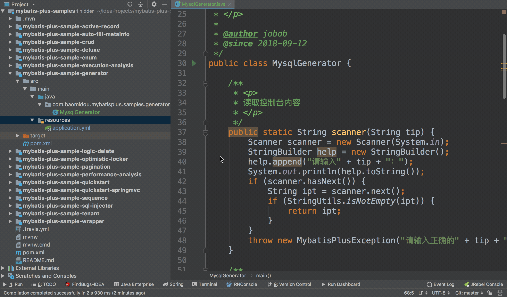

# Mybatis-Plus + 代码生成器整合使用

> 个人开发环境
>
> java环境：Jdk1.8.0_60
>
> 编译器：IntelliJ IDEA 2017.1.4
>
> Mybatis-Plus 版本：3.x
>
> freemarker模板 版本：2.3.28 （用于mp代码生成器的模板引擎，可根据个人喜好更换模板）
>
> 官方文档：<https://mp.baomidou.com/guide/>
>
> 源码连接：待整理

## 第一步 添加依赖

`官方提示`：引入 `MyBatis-Plus` 之后请不要再次引入 `MyBatis` 以及 `MyBatis-Spring`，以避免因版本差异导致的问题。

```xml
<!--springBoot 相关依赖-->
<parent>
    <groupId>org.springframework.boot</groupId>
    <artifactId>spring-boot-starter-parent</artifactId>
    <version>2.1.3.RELEASE</version>
</parent>

<!--约定版本-->
<properties>
    <mybatis-spring-boot.version>1.2.0</mybatis-spring-boot.version>
    <mysql-connector.version>5.1.39</mysql-connector.version>
    <mybatis-plus.version>3.1.0</mybatis-plus.version>
    <mybatis-plus-generator.version>3.1.0</mybatis-plus-generator.version>
    <freemarker.version>2.3.28</freemarker.version>
</properties>

<dependencies>
    <!--springBoot 相关依赖-->
    <dependency>
        <groupId>org.springframework.boot</groupId>
        <artifactId>spring-boot-starter-web</artifactId>
    </dependency>

    <!--mybatis-plus 相关依赖-->
    <dependency>
        <groupId>com.baomidou</groupId>
        <artifactId>mybatis-plus-boot-starter</artifactId>
        <version>${mybatis-plus.version}</version>
    </dependency>

    <!--mybatis-plus代码生成器 相关依赖-->
    <dependency>
        <groupId>com.baomidou</groupId>
        <artifactId>mybatis-plus-generator</artifactId>
        <version>${mybatis-plus-generator.version}</version>
    </dependency>

    <!--代码生成器使用freemarker模板引擎 相关依赖-->
    <dependency>
        <groupId>org.freemarker</groupId>
        <artifactId>freemarker</artifactId>
        <version>${freemarker.version}</version>
    </dependency>

    <!--mysql驱动 相关依赖-->
    <dependency>
        <groupId>mysql</groupId>
        <artifactId>mysql-connector-java</artifactId>
        <version>${mysql-connector.version}</version>
    </dependency>

    <!--pojo实用小插件-->
    <dependency>
        <groupId>org.projectlombok</groupId>
        <artifactId>lombok</artifactId>
        <!--依赖不传递-->
        <optional>true</optional>
    </dependency>
</dependencies>
```


## 第二步 配置文件

### application.yml（src/main/resources/application.yml）

```yml
server:
  # 服务端口
  port: 8084

spring:
  datasource:
    url: jdbc:mysql://localhost:3306/springboot-mybatis
    username: root
    password: 123456
    driver-class-name: com.mysql.jdbc.Driver

# Mybatis 配置
mybatis:
  typeAliasesPackage: com.fame.entity
  mapperLocations: classpath:mapper/*.xml

# 打印sql
logging:
  level:
     # 配置mapper接口的包路径
     com.fame.mapper : debug
```


### CodeGenerator.java（src\main\java\com\fame\generator\CodeGenerator.java）

`mp代码生成器官方Api文档`:<https://mp.baomidou.com/config/>

可根据具体需求配置代码生成器相关属性

```java
public class CodeGenerator {

	/**
	 * <p>
	 * 读取控制台内容
	 * </p>
	 */
	public static String scanner(String tip) {
		Scanner scanner = new Scanner(System.in);
		StringBuilder help = new StringBuilder();
		help.append("请输入" + tip + "：");
		System.out.println(help.toString());
		if (scanner.hasNext()) {
			String ipt = scanner.next();
			if (StringUtils.isNotEmpty(ipt)) {
				return ipt;
			}
		}
		throw new MybatisPlusException("请输入正确的" + tip + "！");
	}

	public static void main(String[] args) {
		// 代码生成器
		AutoGenerator mpg = new AutoGenerator();

		// 全局配置
		GlobalConfig gc = new GlobalConfig();
		final String projectPath = System.getProperty("user.dir");
		gc.setOutputDir(projectPath + "/fame-springboot-mybatis-mybatisplus/src/main/java");
		gc.setAuthor("Y.yang");
		gc.setBaseResultMap(true);
		gc.setBaseColumnList(true);
		// 是否打开输出目录 默认为true
		gc.setOpen(false);
		mpg.setGlobalConfig(gc);

		// 数据源配置
		DataSourceConfig dsc = new DataSourceConfig();
		dsc.setUrl("jdbc:mysql://localhost:3306/springboot-mybatis?useUnicode=true&useSSL=false&characterEncoding=utf8");
		dsc.setDriverName("com.mysql.jdbc.Driver");
		dsc.setUsername("root");
		dsc.setPassword("123456");
		mpg.setDataSource(dsc);

		// 包配置
		final PackageConfig pc = new PackageConfig();
		// pc.setModuleName(scanner("模块名"));
		pc.setParent("com.fame");
		mpg.setPackageInfo(pc);

		// 自定义配置
		InjectionConfig cfg = new InjectionConfig() {
			@Override
			public void initMap() {
				// to do nothing
			}
		};

		// 如果模板引擎是 freemarker
		String templatePath = "/templates/mapper.xml.ftl";
		// 如果模板引擎是 velocity
		// String templatePath = "/templates/mapper.xml.vm";

		// 自定义输出配置
		List<FileOutConfig> focList = new ArrayList<FileOutConfig>();
		// 自定义配置会被优先输出
		focList.add(new FileOutConfig(templatePath) {
			@Override
			public String outputFile(TableInfo tableInfo) {
				// 自定义输出文件名 ， 如果你 Entity 设置了前后缀、此处注意 xml 的名称会跟着发生变化！！
				return projectPath + "/fame-springboot-mybatis-mybatisplus/src/main/resources/mapper/" + tableInfo.getEntityName() + "Mapper" + StringPool.DOT_XML;
			}
		});
		cfg.setFileOutConfigList(focList);
		mpg.setCfg(cfg);

		// 配置模板
		TemplateConfig templateConfig = new TemplateConfig();
		// 配置自定义输出模板
		// 指定自定义模板路径，注意不要带上.ftl/.vm, 会根据使用的模板引擎自动识别
		// templateConfig.setEntity("templates/entity2.java");
		// templateConfig.setService();
		// templateConfig.setController();
		templateConfig.setXml(null);
		mpg.setTemplate(templateConfig);

		// 策略配置
		StrategyConfig strategy = new StrategyConfig();
		strategy.setNaming(NamingStrategy.underline_to_camel);
		strategy.setColumnNaming(NamingStrategy.underline_to_camel);
		// strategy.setSuperEntityClass("com.fame.common.BaseEntity");
		strategy.setEntityLombokModel(true);
		strategy.setRestControllerStyle(true);
		// strategy.setSuperControllerClass("com.fame.common.BaseController");
		strategy.setInclude(scanner("表名，多个英文逗号分割").split(","));
		strategy.setSuperEntityColumns("id");
		// strategy.setControllerMappingHyphenStyle(true);
		strategy.setTablePrefix("sys");
		mpg.setStrategy(strategy);
		mpg.setTemplateEngine(new FreemarkerTemplateEngine());
		mpg.execute();
	}
}
```


## 第三步 代码生成




`注意`：同mybatis generator 逆向工程，生成的**XXXMapper.xml**，需要放到（src/main/resource）下.

`原因`：IDEA不编译src的java目录下的xml文件


## 第四步 创建Application启动类

如果是直接创建springboot项目可忽略这一步，我是直接创建的一个Maven项目进行整合。

`注意`:加入注解**@MapperScan**进行mapper接口扫描

```java
@SpringBootApplication
@MapperScan("com.fame.mapper")
public class MybatisPlusApplication {
	public static void main(String[] args) {
		SpringApplication.run(MybatisPlusApplication.class, args);
	}
}

```

这样就整合完成，可以创建接口进行单元测试了

## 第五步 实例简单测试

**代码生成器生成的UserMapper.java 会集成MP公共方法BaseMapper.java,其中封装了常用的增删查改方法,如下:**

```java
public interface UserMapper extends BaseMapper<User> {
    // 自定义SQL方法
}
```

```java
public interface BaseMapper<T> {
    int insert(T var1);

    int deleteById(Serializable var1);

    int deleteByMap(@Param("cm") Map<String, Object> var1);

    int delete(@Param("ew") Wrapper<T> var1);

    int deleteBatchIds(@Param("coll") Collection<? extends Serializable> var1);

    int updateById(@Param("et") T var1);

    int update(@Param("et") T var1, @Param("ew") Wrapper<T> var2);

    T selectById(Serializable var1);

    List<T> selectBatchIds(@Param("coll") Collection<? extends Serializable> var1);

    List<T> selectByMap(@Param("cm") Map<String, Object> var1);

    T selectOne(@Param("ew") Wrapper<T> var1);

    Integer selectCount(@Param("ew") Wrapper<T> var1);

    List<T> selectList(@Param("ew") Wrapper<T> var1);

    List<Map<String, Object>> selectMaps(@Param("ew") Wrapper<T> var1);

    List<Object> selectObjs(@Param("ew") Wrapper<T> var1);

    IPage<T> selectPage(IPage<T> var1, @Param("ew") Wrapper<T> var2);

    IPage<Map<String, Object>> selectMapsPage(IPage<T> var1, @Param("ew") Wrapper<T> var2);
}

```


### 新增（insert）

```java
/**
 * 用户信息新增
 */
@Override
public void add(User user) {
    userMapper.insert(user);
}
```

### 修改（update）

```java
/**
 * 用户信息修改
 */
@Override
public void updateByUser(User user) {
    userMapper.updateById(user);

}
```


### 删除（delete）

```java
/**
 * 用户信息删除
 */
@Override
public void deleteById(Long id) {
    userMapper.deleteById(id);
}
```


### 查询（select）

```java
/**
 * 用户信息查询全部
 *
 * @return 用户信息列表
 */
@Override
public List<User> findAll() {
    QueryWrapper<User> queryWrapper = new QueryWrapper<User>();
    return userMapper.selectList(queryWrapper);
}
```


**其中Wrapper相关critiria 条件查询，参考官方文档**


