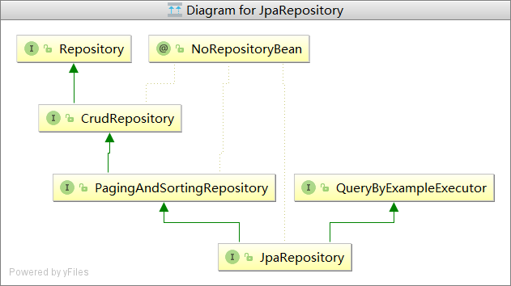
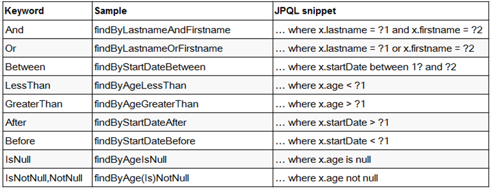
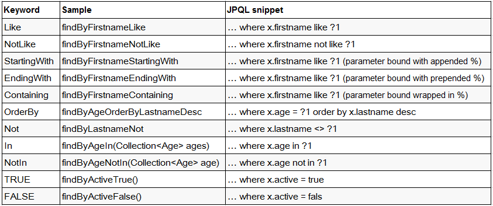

# SpringData概述

SpringData ：Spring的一个子项目。用于简化数据库访问，支持NoSQL和关系数据存储。其主要目标是使用数据库的访问变得方便快捷。

SpringData 项目所支持NoSQL存储：

- MongoDB（文档数据库）
- Neo4j（图形数据库）
- Redis（键/值存储）
- Hbase（列族数据库）

SpringData 项目所支持的关系数据存储技术：

- JDBC
- JPA

Spring Data : 致力于减少数据访问层 (DAO) 的开发量. 开发者唯一要做的，就只是**声明持久层的接口**，其他都交给 Spring Data JPA 来帮你完成！

框架怎么可能代替开发者实现业务逻辑呢？比如：当有一个 `UserDao.findUserById()`  这样一个方法声明，大致应该能判断出这是根据给定条件的 ID 查询出满足条件的 User  对象。Spring Data JPA 做的便是规范方法的名字，根据符合规范的名字来确定方法需要实现什么样的逻辑。

# SpringBoot+SpringData 整合入门

**第一步** 添加依赖

**springBoot相关**

```pom
	<parent>
        <groupId>org.springframework.boot</groupId>
        <artifactId>spring-boot-starter-parent</artifactId>
        <version>1.5.9.RELEASE</version>
    </parent>
    <dependencies>
        <dependency>
            <groupId>org.springframework.boot</groupId>
            <artifactId>spring-boot-starter-web</artifactId>
        </dependency>
    </dependencies>
```

**mysql驱动**

```pom
    <dependency>
        <groupId>mysql</groupId>
    	<artifactId>mysql-connector-java</artifactId>
    </dependency>
```

**springDataJPA相关**

```pom
    <dependency>
    	<groupId>org.springframework.boot</groupId>
    	<artifactId>spring-boot-starter-data-jpa</artifactId>
    </dependency>
```

**第二步** 配置文件 （src/main/resources/application.yml）

```yml
spring:
  datasource:
    url: jdbc:mysql://localhost:3306/springboot-springdata
    username: root
    password: 123456
    driver-class-name: com.mysql.jdbc.Driver
  jpa:
    #指定数据库
    database: mysql
    #打印sql
    show-sql: true
    hibernate:
      #开启数据库更新表
      ddl-auto: update
      #指定命名策略
      naming:
        strategy: org.hibernate.cfg.ImprovedNamingStrategy
    properties:
      hibernate:
        #Hibernate方言
        dialect: org.hibernate.dialect.MySQL5Dialect
```

第三步 创建Repository接口、Entity

**Repository接口**

```java
public interface UserRepository extends JpaRepository<User, Long>, JpaSpecificationExecutor<User> {}
```

**Entity**（启动项目会自动创建表）

```java
@DynamicInsert(true)
@DynamicUpdate(true)
@Table(name = "sys_user")
public class User implements Serializable{

	private static final long serialVersionUID = 6425411731900579688L;

	@Id
	@GeneratedValue
	@Column(columnDefinition = "bigint(20) comment '主键'", nullable = false)
	private long id;

	@Column(columnDefinition = "varchar(255) comment '用户姓名'",nullable = false, unique = true)
	private String username;

	@Column(columnDefinition = "varchar(255) comment '密码'", nullable = false)
	private String password;

	@Column(columnDefinition = "int(10) comment '年龄'", nullable = false)
	private int age;

}
```

这样就整合完成，可以创建接口进行单元测试了

# Repository接口概述

Repository 接口是 Spring Data 的一个核心接口，它不提供任何方法，开发者需要在自己定义的接口中声明需要的方法 

```java
public interface Repository<T, ID extends Serializable> { } 
```

Spring Data可以让我们只定义接口，只要遵循 Spring Data的规范，就无需写实现类。  

与继承 Repository 等价的一种方式，就是在持久层接口上使用 `@RepositoryDefinition` 注解，并为其指定 `domainClass `和` idClass `属性。如下两种方式是完全等价的

```java
/**
 * 主键方式定义接口
 */
@RepositoryDefinition(domainClass=Person.class,idClass=Integer.class)
public interface PersonRepsotory{}

/**
 * 继承方式定义接口
 * 常用
 */
public interface PersonRepsotory extends JpaRepository<Person, Integer>{}
```

## Repository的子接口



如图，基础的 Repository 提供了最基本的数据访问功能，其几个子接口则扩展了一些功能。它们的继承关系如下： 
`Repository`： 仅仅是一个标识，表明任何继承它的均为仓库接口类
`CrudRepository`： 继承 Repository，实现了一组 CRUD 相关的方法 
`PagingAndSortingRepository`： 继承 CrudRepository，实现了一组分页排序相关的方法 
`JpaRepository`： 继承 PagingAndSortingRepository，实现一组 JPA 规范相关的方法 
`自定义的 XxxxRepository`： 需要继承 JpaRepository，这样的 XxxxRepository接口就具备了通用的数据访问控制层的能力。
`JpaSpecificationExecutor`： 不属于Repository体系，实现一组 JPA Criteria 查询相关的方法 

# SpringData 查询方法命名规范

简单条件查询: 查询某一个实体类或者集合 
按照 Spring Data 的规范，查询方法以 `find | read | get `开头， 涉及条件查询时，条件的属性用条件关键字连接，要注意的是：条件属性以首字母大写。 
例如：定义一个 Entity 实体类

```java
class User｛ 
    private String firstName; 
	private String lastName; 
｝ 

```

使用And条件连接时，应这样写：` findByLastNameAndFirstName(String lastName,String firstName);`条件的属性名称与个数要与参数的位置与个数一一对应

**支持的关键字**





# springData 查询方法解析原理

假如创建如下的查询：`findByUserDeptUuid()`，框架在解析该方法时，首先剔除 `findBy`，然后对剩下的属性进行解析，假设查询实体为UserInfo。

**第一步**：先判断 userDeptUuid （根据 POJO 规范，首字母变为小写）是否为查询实体的一个属性，如果是，则表示根据该属性进行查询；如果没有该属性，继续第二步；

**第二步**：从右往左截取第一个大写字母开头的字符串(此处为Uuid)，然后检查剩下的字符串是否为查询实体的一个属性，如果是，则表示根据该属性进行查询；如果没有该属性，则重复第二步，继续从右往左截取；最后假设 user 为查询实体的一个属性；

**第三步**：接着处理剩下部分（DepUuid），先判断 user 所对应的类型是否有deptUuid属性，如果有，则表示该方法最终是根据 “ UserInfo.user.deptUuid” 的取值进行查询；否则继续按照步骤 二的规则从右往左截取，最终表示根据 “UserInfo.user.dept.uuid” 的值进行查询。可能会存在一种特殊情况，比如 UserInfo包含一个 user 的属性，也有一个 userDep 属性，此时会存在混淆。可以明确在属性之间加上 "_" 以显式表达意图，比如 "findByUser_DepUuid()" 或者 "findByUserDept_Uuid()"


# springData 实战

## 命名方法查询

```java
public interface UserRepository extends JpaRepository<User, Long>, JpaSpecificationExecutor<User> {
	/**
	 * 根据username来获取对应的user
	 */
	User getByUsername(String username);

	/**
	 * WHERE username LIKE %?
	 */
	List<User> findByUsernameStartingWith(String username);

	/**
	 * WHERE username LIKE ?%
	 */
	List<User> findByUsernameEndingWith(String username);

	/**
	 * WHERE username id < ?
	 */
	List<User> findByIdLessThan(Long id);
}

```

## 注解查询

```java
public interface UserRepository extends JpaRepository<User, Long>, JpaSpecificationExecutor<User> {
	/**
	 * 查询id 值最大的那个User 使用@Query 主键可以自定义JPQL语句以实现更灵活的查询
	 */
	@Query("SELECT u FROM User u WHERE u.id = (SELECT MAX(p.id) FROM User p)")
	User getMaxIdUser();

    /**
     * @Query 注解传递参数的方式一：占位符方式
     */
    @Query("SELECT u FROM User u WHERE u.username = ?1 AND u.age = ?2")
	List<User> testQueryAnnotationUser1(String username , Integer age);

    /**
     * @Query 注解传递参数的方式二：命名参数方式
     */
    @Query("SELECT u FROM User u WHERE u.username = :username AND u.age = :age")
    List<User> testQueryAnnotationUser2(@Param("username") String username , @Param("age")Integer age);
}

```


可以通过自定义的 JPQL 完成 UPDATE 和 DELETE 操作，`注意`: JPQL 不支持使用 INSERT。

在 @Query 注解中编JPQL 语句, 但`必须使用 @Modifying 进行修饰`. 以通知 SpringData, 这是一个 UPDATE 或 DELETE 操作。

UPDATE 或 DELETE 操作需要使用事务,` 可以使用注解@Transactional声明`，默认情况下, SpringData 的每个方法上有事务, 但都是一个只读事务. 他们不能完成修改操作!

```java
public interface UserRepository extends JpaRepository<User, Long>, JpaSpecificationExecutor<User> {
    /**
     * @Query 注解update、delete操作，不支持insert
     */
    @Modifying
    @Query("UPDATE User u SET u.age = :age")
	@Transactional
    void updateUserAge(@Param("age") Integer age);
    
}

```


还可以使用原生Sql查询，只需配置`nativeQuery = true`

```java
public interface UserRepository extends JpaRepository<User, Long>, JpaSpecificationExecutor<User> {
    /**
     * 设置 nativeQuery=true 即可以使用原生的 SQL 查询
     */
    @Query(value = "SELECT COUNT(id) FROM sys_user" , nativeQuery = true)
    long getTotalCount();
}

```


