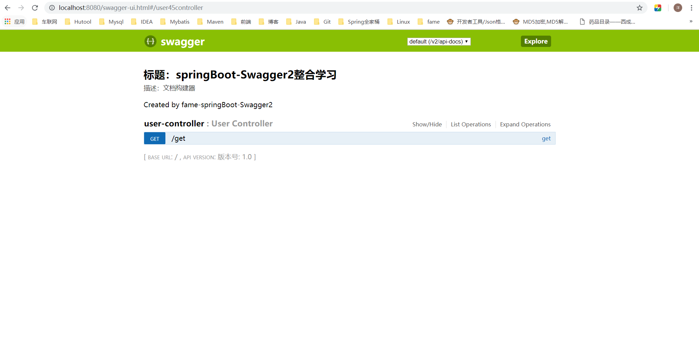

# SpringBoot+Swagger2四步整合

## 第一步：添加相关依赖

```xml
<parent>
    <groupId>org.springframework.boot</groupId>
    <artifactId>spring-boot-starter-parent</artifactId>
    <version>1.5.9.RELEASE</version>
</parent>

<properties>
    <swagger2.version>2.7.0</swagger2.version>
</properties>

<dependencies>
    <!--springBoot 相关依赖-->
    <dependency>
        <groupId>org.springframework.boot</groupId>
        <artifactId>spring-boot-starter-web</artifactId>
    </dependency>
    <!--swagger2 相关依赖-->
    <dependency>
        <groupId>io.springfox</groupId>
        <artifactId>springfox-swagger2</artifactId>
        <version>${swagger2.version}</version>
    </dependency>
    <dependency>
        <groupId>io.springfox</groupId>
        <artifactId>springfox-swagger-ui</artifactId>
        <version>${swagger2.version}</version>
    </dependency>

</dependencies>
```

创建SrpingBoot启动类

```java
/**
 * Springboot+Swagger整合启动类
 * 
 * @author Y.yang
 * @date 2019/3/12
 */
@SpringBootApplication
public class SwaggerApplication {

	public static void main(String[] args) {
		SpringApplication.run(SwaggerApplication.class, args);
	}
}

```


## 第二步：配置Swagger2

注意添加`@Configuration` `EnableSwagger2`注解

```java
/**
 * Swagger2 接口Api文档 配置文件
 * 
 * @author Y.yang
 * @date 2019/3/12
 */
@Configuration
@EnableSwagger2
public class SwaggerConfig {

    /**
     * 初始化创建Swagger Api
     */
    @Bean
	public Docket createRestApi() {
		return new Docket(DocumentationType.SWAGGER_2)
				// 详细信息定制
				.apiInfo(apiInfo())
				.select()
				// 指定当前包路径
				.apis(RequestHandlerSelectors.basePackage("com.fame.controller"))
				// 扫描所有 .apis(RequestHandlerSelectors.any())
				.paths(PathSelectors.any())
				.build();
	}

	/**
	 * 添加摘要信息
	 */
	private ApiInfo apiInfo() {
		// 用ApiInfoBuilder进行定制
		return new ApiInfoBuilder()
				.title("标题：springBoot-Swagger2整合学习")
				.description("描述：文档构建器")
				.contact(new Contact("Fame-springBoot-Swagger2", null, null))
				.version("版本号: 1.0")
				.build();
	}
}

```

springfox为我们提供了一个Docket（摘要的意思）类，我们需要把它做成一个Bean注入到spring中， 
显然，我们需要一个配置文件，并通过一种方式（显然它会是一个注解）告诉程序，这是一个Swagger配置文件。

springfox允许我们将信息组合成一个ApiInfo的类，作为构造参数传给Docket（当然也可以不构造这个类，而直接使用null，但是你的这个API就太low了）。


## 第三步：创建测试实例

```java
/**
 * Swagger接口测试
 * 
 * @author Y.yang
 * @date 2019/3/12
 */
@RestController
public class UserController {

    @GetMapping("/get")
    public String get(){
        return "Hello Swagger2";
    }
}
```


## 第四步：输入SwaggerUI地址

http://localhost:8080/swagger-ui.html



# Swagger2基本使用-常用注解

## 接口/方法常用注解

```java
/**
 * Swagger接口测试
 * 
 * @author Y.yang
 * @date 2019/3/12
 */
@Api(value = "用户信息", tags = { "用户信息" })
@RestController
public class UserController {

	@ApiOperation(value = "用户信息分页查询")
	@GetMapping("/page")
	public String page(User user) {
		return "Hello Swagger2";
	}

	@ApiOperation(value = "用户信息查询")
	@ApiImplicitParams({
		@ApiImplicitParam(name = "id", value = "用户ID", required = true, dataType = "Integer"),
		@ApiImplicitParam(name = "file", value = "文件导入", required = true, dataType = "MultipartFile")
	})
	@GetMapping("/id")
	public UserVo getUser(Long id, MultipartFile file) {
		return new UserVo();
	}
}
```

### @Api: 描述类/接口的主要用途

用于类；表示标识这个类是swagger的资源 
tags–表示说明 
value–也是说明，不会显示在接口文档上，可以使用tags替代 

**但是tags如果有多个值，会生成多个list**

```java
@Api(value = "用户信息", tags = { "用户信息" })
```

### @ApiOperation: 描述方法用途

```java
@ApiOperation(value = "用户信息分页查询")
```

### @ApiImplicitParam: 描述方法的参数

### @ApiImplicitParams: 描述方法的参数(Multi-Params)

```java
@ApiImplicitParams({
	@ApiImplicitParam(name = "id", value = "用户ID", required = true, dataType = "Integer"),
	@ApiImplicitParam(name = "file", value = "文件导入", dataType = "MultipartFile")
})
```

## 实体类常用注解

```java
/**
 * 用户信息 数据传输对象 Dto（Data Transfer Object）
 * 
 * @author Y.yang
 * @date 2019/3/29
 */
@ApiModel(description = "用户信息请求对象")
@Data
public class User implements Serializable {

	private static final long serialVersionUID = -6986638131456347054L;

	@ApiModelProperty(value = "姓名")
	private String username;

	@ApiModelProperty(value = "性别")
	private String sex;

	@ApiModelProperty(value = "年龄")
	private Integer age;

}
```


### @ApiModel:描述实体类（Dto、Vo、Do等）

```java
@ApiModel(description = "用户信息请求对象")
```

### @ApiModelProperty：描述实体类的字段

```java
@ApiModelProperty(value = "姓名")
```


